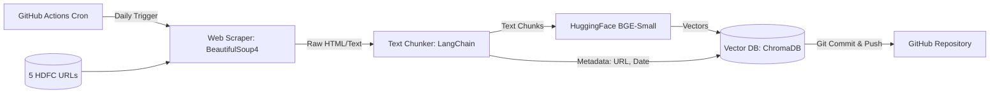
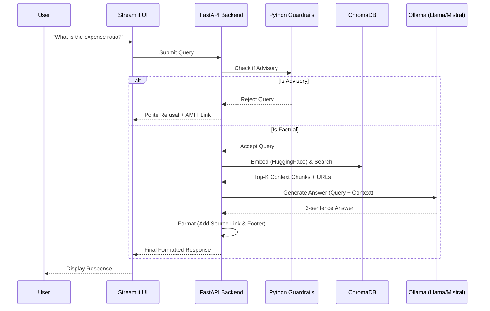

# Architecture: Mutual Fund FAQ Assistant (Free/Open-Source Stack)

## 1. Overview
The Mutual Fund FAQ Assistant is built using a Retrieval-Augmented Generation (RAG) architecture. This approach ensures that the assistant grounds its answers exclusively in the curated official documents (Groww/HDFC URLs) and avoids hallucination or speculative investment advice. The entire stack utilizes 100% free, open-source, and locally hosted tools.

## 2. High-Level Architecture Diagram

```mermaid
graph TD
    User([User]) -->|Inputs Query| UI[Streamlit UI]
    UI -->|Sends Query| Backend[FastAPI Backend]
    
    subgraph RAG System (100% Free Stack)
        Backend --> Guardrails{Guardrails/Advisory Check}
        Guardrails -->|Rejected| Refusal[Refusal Response]
        Refusal --> UI
        
        Guardrails -->|Accepted| Embedding[HuggingFace Embedding Model]
        Embedding -->|Vector| VectorDB[(ChromaDB / FAISS)]
        
        VectorDB -->|Top-K Chunks| LLM[Local LLM via Ollama]
        LLM -->|Draft Answer| Formatter[Response Formatter]
        Formatter -->|Adds Link & Footer| Backend
    end
    
    Backend -->|Final Answer| UI
```

## 3. System Components

The architecture consists of primary components across data ingestion and online query processing, strictly using free tooling.

### 3.1 Data Ingestion and Indexing Pipeline
This offline/background process is responsible for building the knowledge base.



- **Web Scraper:** **BeautifulSoup4** + **Requests** to scrape text content from the 5 HDFC mutual fund URLs.
- **Chunking:** **Document-Level Chunking**. Because the parsed JSON files are small (~200 tokens), the entire parsed JSON for a fund is concatenated into a single string chunk to perfectly preserve context.
- **Embedding Model:** **HuggingFace** sentence transformers (using `BAAI/bge-small-en-v1.5` for state-of-the-art retrieval accuracy) which runs locally and for free to convert text chunks into dense vectors.
- **Vector Database:** **ChromaDB** running locally to store embeddings and metadata (source URL, last updated date). ChromaDB was explicitly chosen over FAISS because it natively stores document payloads and metadata, which is perfect for our small 5-fund dataset scale.
- **Automation:** A **GitHub Actions** workflow triggers this entire ingestion pipeline daily at exactly 10:00 AM IST. The action then explicitly commits the freshly updated ChromaDB data back to the repository to persist the changes.

### 3.2 Query Processing and Retrieval
1. **Query Embedding:** The user's text is converted into a vector using the identical HuggingFace Embedding Model.
2. **Similarity Search:** ChromaDB is queried to find the top-K most relevant chunks based on semantic similarity.

### 3.3 Guardrails and Refusal Handling
- **Advisory Detection:** A local heuristic checker or a small local LLM checks if the query is seeking investment advice (e.g., _"Should I invest in this fund?"_).
- **Refusal Mechanism:** If non-factual or advisory, the system returns a predefined, polite refusal message and an AMFI/SEBI educational link.

### 3.4 Response Generation
- **Local LLM:** A free, open-weights Large Language Model (like **Llama 3 8B** or **Mistral**) running locally via **Ollama**.
- **System Prompt:** Instructs the LLM to answer only based on provided context, limit to a maximum of 3 sentences, and include exactly one citation link.

### 3.5 User Interface (UI)
- **Frontend Framework:** **Streamlit**, an open-source Python framework for building lightweight UIs.
- **Elements:** Welcome message, three example questions, and a visible disclaimer: _“Facts-only. No investment advice.”_

## 4. Request Flow (Sequence)


